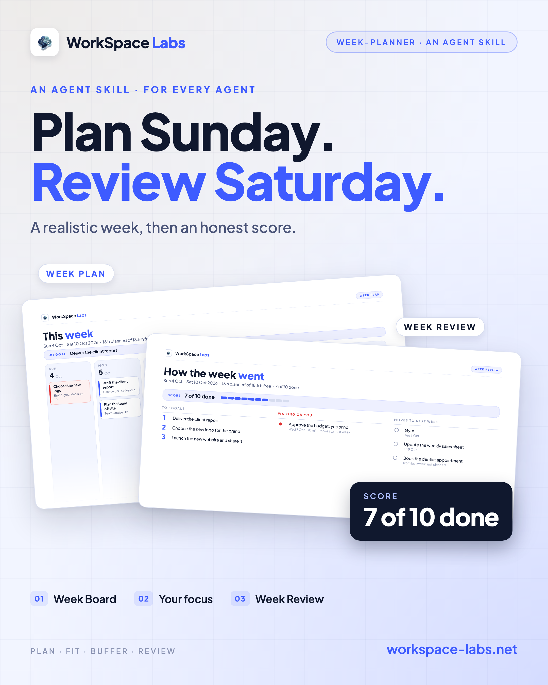
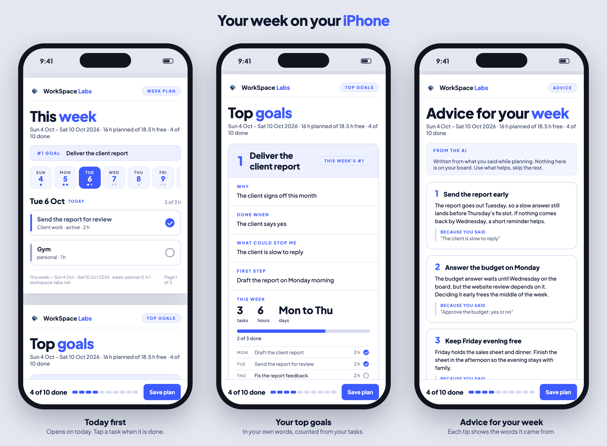

# week-planner



**Plan your week, or your weekend, calmly. Tick it off as you go. Then see how it went.**

An agent skill that turns "plan my week" into a realistic plan: your real tasks fitted into the free hours
of each day, never overfilled, with a buffer slot for when things take longer. You get a **Week Board**
PDF: seven day columns, one card per task, red for the decisions waiting on you; then a **Top goals** page
in your own words, and a page of **advice** for your week. Ask for it, and the same week comes as an
**HTML page** you keep open and tick tasks off on. At the end of the week, "review my week" scores what got
done and carries the rest over.

It works in every agent and app: Claude Code, the Claude app and website, Codex and others. It asks you
for your tasks everywhere, and also reads your Backloop board (read only) where one exists.

**Version 0.4.2** · **113 tests, all passing on Windows** · [Windows review and fixes](docs/windows-review.md) · [the proof](#proof-how-we-know-it-works)

---

## What you say

| You say | You get |
|---|---|
| "plan my week" | A few click questions (free hours, free days, your goals: why, done when, what could stop you, first step), a read-back, then the Week Plan PDF |
| "plan my week, as an HTML page too" | The same week as one HTML page: click a task when it is done, and **Save plan** keeps your ticks |
| "plan my weekend" | Your weekend days, at most 3 tasks, plus a fun or personal item if you want one |
| "review my week" | Tick what got done (or use the ticks you saved) and say how each goal went: a Week Review PDF with the score, each goal's verdict, and what moves to next week |

Where the app cannot run code, the same plan comes back as a table in the chat.

## What the PDF holds

1. **The Week Board**: the #1 goal in a band, then one column per day. Each card has a bar for its stage
   (active, review, plan), red for a decision waiting on you, hatched for buffer time, and each day shows
   hours planned of hours free. The columns end together just under the busiest day. Under the board:
   what is waiting on you and what carried over (in a review: the score, and what moves to next week), or
   on a page of their own when the board is full.
2. **Top goals**: your #1 goal across the page with **Why**, **Done when**, **What could stop me** and
   **First step** in your own words, and **This week** counted from its cards (tasks, hours, days, and the
   cards themselves). Goals 2 and 3 sit below it. In a review, each goal gets your verdict: **Reached**,
   **Close** or **Not yet**.
3. **Advice for your week** (when there is some): up to five tips the AI writes from what you already said,
   with no extra questions. Each shows **"Because you said ..."** with your own words from the plan, and
   real-world facts carry a "check before you book" note. Nothing on this page goes on your board.

A weekend plan stays one page, with its goal under the board.

**The HTML page** shows the same three pages. Click a task when it is done: the score, the day totals and
the goals move at once. **Save plan** downloads the plan file with your ticks, for the review. It is one
file that needs no internet. **On a phone** it opens on today: tabs for the days, today's tasks as big cards
for your thumb, and the score with Save plan always at the bottom.

Waiting decisions and carried-over work also appear below the HTML board; the lists update as you tick.
Weekend goal details stay below their board. Browser ticks belong to that exact source plan: use Save
plan before regenerating it to keep progress that exists only in your browser.



The look is the WorkSpace Labs house look, the same family as the workflow-project PDF: Plus Jakarta Sans,
a light ground, one blue accent, red only for "waiting on you".

## Install

The drawing tool needs Python 3.9 or newer and `reportlab` (already in Claude's and ChatGPT's sandboxes;
elsewhere `python3 -m pip install reportlab`).

On Windows, use `python` in place of `python3` when needed. UTF-8 JSON with or without a BOM works.

**Claude Code, Codex and other agents**, in one line:

```bash
npx skills add workspace-labs/week-planner -g
```

Or by hand, for Claude Code:

```bash
git clone https://github.com/workspace-labs/week-planner.git
mkdir -p ~/.claude/skills
cp -R week-planner/skills/week-planner ~/.claude/skills/
```

**Claude app (chat and Cowork)**: make the zip, then upload it in **Customize → Skills**.

```bash
cd week-planner
rm -f dist/week-planner.zip && mkdir -p dist
(cd skills && zip -r -X ../dist/week-planner.zip week-planner -x '*/__pycache__/*' '*.pyc' '*.DS_Store')
```

Then start a fresh session and say "plan my week".

## Run the drawing tool yourself

```bash
python3 skills/week-planner/scripts/draw_week.py skills/week-planner/examples/week.json -o "Week Plan.pdf"
python3 skills/week-planner/scripts/draw_week.py skills/week-planner/examples/week.json --html   # the page to tick off
python3 skills/week-planner/scripts/draw_week.py my-plan.json --check      # checks only
```

The plan file format is in `skills/week-planner/references/plan-format.md`.

## Proof: how we know it works

We do not call it built until it is proven. Everything below can be checked.

### 113 automated tests, all passing

Run them yourself (Python 3.9+ and `reportlab`; `poppler` for the checks that read the PDFs back; Google
Chrome for the checks that run the HTML page in a real browser):

```bash
python3 -B -m unittest discover -s tests
```

On version 0.4.2 (Windows, Python 3.12.10, ReportLab 5.0.1, Chrome 143, Poppler 26.09.0):
**113 passed, 0 skipped, 0 failed.** The updated release has not been rerun on macOS or Linux.
Chrome is found in standard Windows locations, or set `CHROME_BIN` to its path. Put current Poppler's
`bin` directory on `PATH` to run the PDF text and preview checks.

| What is tested | Tests |
|---|---:|
| The plan rules and their plain-language refusals: an overfilled day, no buffer, too much for a weekend, a half-marked review, emoji, wrong dates (including compact dates), NaN, tiny or huge hours, carried-over tasks and their links, goals with their why, done-when, risk, first step, project and verdict, and advice whose "because" must be the person's own words | 55 |
| The board's geometry, judged by independent rectangle maths: every card inside its column, nothing overlapping, every line fits, "1 h" never split, columns end together under the busiest day | 9 |
| The whole tool, end to end: drawn PDFs read back word by word with `pdftotext`, command exit codes, source JSON protected against overwrite and hard links, Windows BOM files, output errors, the footer, planned totals, portable previews that never overwrite a file, focus placement, Top goals and advice page fit, and "and N more" past 8 cards | 37 |
| The HTML page: its default name, no network, safe text, no writes on refusal; real Chrome clicks and saved JSON; ticks survive reopening, edited or newly reviewed plans do not inherit old marks; visible carry-over and weekend goal details; phone today view, synchronized ticks, fixed bar and no side overflow, including long titles | 12 |
| **Total** | **113** |

### Reviewed by a second agent

A second AI agent, Codex, reviewed the skill in a fresh session: it had not watched the build and checked
everything from the repository itself. Over five rounds it found **7 real problems**. Each was fixed with a
test that failed before the fix and passes after it, and on 5 October 2026 its verdict was **APPROVED**. That review covers 0.1.1; the 0.2.0 layout change
(short columns, focus under the board) 0.3.0 (Top goals and advice pages, the HTML page) and 0.4.0 (the phone
view) were not covered by that original review. The independent Windows review of 0.4.2 covers these
features through automated tests and scripted examples; its scope and limits are in
[the Windows review](docs/windows-review.md).

| Finding | What was wrong | Closed in round |
|---|---|---:|
| F01 | A carried-over task could be lost, listed twice, or come back after it was done | 4 |
| F02 | A weekend demanded a personal item, though personal items are optional | 2 |
| F03 | A long title and website could run into the page number | 2 |
| F04 | NaN or infinite hours crashed the tool instead of being refused | 2 |
| F05 | A huge number of hours crashed the tool instead of being refused | 3 |
| B04 | Previewing the pages could overwrite a file named `page-1.png` | 4 |
| B06 | "Planned" left out buffer time in some places but not others | 5 |

On top of the tests, the reviewer ran its own stress checks; it reported, for example, 7,056 carried-over
combinations and 1,050 footer combinations with no failures. Every finding and its fix is in
[CHANGELOG.md](CHANGELOG.md).

### Tried for real

The final version was also used the way a person uses it. A fresh agent (once Claude, once Codex) got only
the skill's instructions and a scripted person: "plan my week" with a carried-over task too long for a card,
then "review my week". Each time it asked its questions first, read the plan back and waited for a yes,
linked the shortened task on its own, and drew a review with the right totals and score.

The owner also planned his own real week with it (5 to 10 October 2026); the tall, mostly empty columns he
saw on that board are what 0.2.0 fixes.

### Not tested yet

The 0.4.2 Windows review covers 113 automated tests and scripted week, review and weekend examples.
Goal fields, advice, carry-over, review scores, generated PDFs, and desktop and phone layouts in Chrome
were checked. The following still need direct testing:

- **Native app discovery and questions:** the skill being picked up automatically inside Claude and
  Codex, and their native clickable answers.
- **Claude app upload:** uploading and using the rebuilt skill ZIP in the Claude app. Its contents and
  extracted drawing tool were checked locally.
- **Chat-only use:** following the table flow in an app where code cannot run.
- **A live Backloop board:** reading real project cards. Earlier tests used a made-up board.
- **An unscripted planning conversation through the installed skill:** asking and polishing the new
  goal answers, receiving the person's confirmations, and writing advice from those answers. Scripted
  examples now cover the resulting goal fields and advice; the owner's earlier chat trial covered the
  questions before the build.
- **Other browsers and a physical iPhone:** the generated HTML in Safari and Firefox; opening it from
  Files or Safari on an iPhone; tapping tasks and saving the plan there. Chrome's phone layout was tested
  on Windows. Safari has only previewed the design demo.
- **The corrected release on macOS and Linux:** version 0.4.2 has been run on Windows. The earlier Mac
  test result was for 0.4.1.

## Limits

- English text only; emoji are refused in the PDF.
- A4 landscape, 1 to 7 days (weekend 1 to 3), about 6 to 8 cards a day.
- The Top goals page lists the #1 goal's first 8 cards; three goals with every answer near its limit are
  refused as too full.
- The HTML page's Save plan downloads the file (browsers cannot write over it in place); keep it with the
  week's PDF.
- Task titles up to 48 characters, 3 lines in their card.

## Layout

```
skills/week-planner/        the skill (what gets installed)
  SKILL.md                  what the agent does
  references/               the plan file format, and the chat table
  scripts/draw_week.py      the drawing tool
  scripts/week_tool/        its parts: model (rules), layout (geometry), pages (the board), booklet (Top goals,
                            advice), page (the HTML page), theme, brand
  examples/                 a week, a weekend and a reviewed week
  assets/                   the fonts (SIL Open Font License), brand.json and the logo
tests/                      the checks (not shipped with the skill)
docs/                       scope, the decision record, and the skill's own workflow PDF
media/                      the pictures on this page
```

## Credits and licence

The code is under the MIT licence (`LICENSE`). Plus Jakarta Sans is by Tokotype under the SIL Open Font
License 1.1 (see `CREDITS.md`). The logo and the WorkSpace Labs name are WorkSpace Labs' own; replace them
with yours through `assets/brand.json`.

---

<sub>by Workspace Labs</sub>
